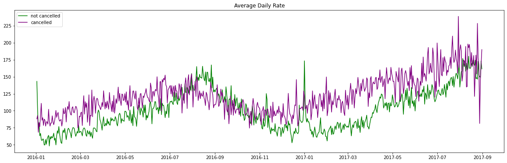

# Hotel Booking Data Analysis
Average daily rate

Bar plot of cancellatons

## Project Overview

This project involves analyzing hotel booking data to optimize pricing strategies and reduce cancellations. By identifying key variables affecting reservation cancellations, actionable insights are suggested that could lead to more efficient pricing and promotional decisions. Notably, logistic regression models and a Random Forest Classifier (RFC) were developed to enhance prediction accuracy.

## Table of Contents

- [Data Source](#data-source)
- [Data Preparation](#data-preparation)
- [Exploratory Analysis](#exploratory-analysis)
- [Feature Selection](#feature-selection)
- [Predictive Modeling](#predictive-modeling)
  - [Random Forest Classifier](#random-forest-classifier)
  - [Logistic Regression](#logistic-regression)
- [Results and Insights](#results-and-insights)
- [Conclusion and Future Steps](#conclusion-and-future-steps)
- [Contributing](#contributing)

## Data Source

The dataset used for this analysis is the "Hotel Booking Demand" dataset from Kaggle.

Dataset Link: [Hotel Booking Demand Dataset](https://www.kaggle.com/jessemostipak/hotel-booking-demand)

## Data Preparation

- Handled missing values and outliers.
- Cleaned and preprocessed the data for analysis.

## Exploratory Analysis

- Explored booking trends, seasonality, and customer demographics.
- Analyzed the relationship between booking cancellations and different features.

## Feature Selection

- Utilized a correlation matrix to identify relevant categorical features.
- Performed Ordinary Least Squares (OLS) Regression on numerical features to uncover correlations.

## Predictive Modeling

### Random Forest Classifier

- Developed a Random Forest Classifier model for predicting cancellations.
- Attempted hyperparameter tuning to improve accuracy.
- Achieved an accuracy score of approximately 0.863 with cross-validation accuracy of 0.787.

### Logistic Regression

- Built logistic regression models for predicting cancellations.
- Achieved an accuracy score of 0.776 with a cross-validation accuracy of 0.787.

## Results and Insights

- The Random Forest Classifier demonstrated competitive performance with an accuracy score of approximately 0.863 and cross-validation accuracy of 0.787.
- The Logistic Regression model achieved an accuracy score of 0.776 with  cross-validation accuracy of 0.754.

## Conclusion and Future Steps

In conclusion, this analysis sheds light on factors influencing hotel booking cancellations. While the Random Forest Classifier achieved promising results, further exploration of hyperparameter tuning and feature engineering may lead to improved accuracy. Future steps could also involve exploring ensemble methods and advanced techniques to further enhance model performance and interpretability.

## Contributing

Contributions are welcome! If you'd like to contribute, please open an issue or submit a pull request.
